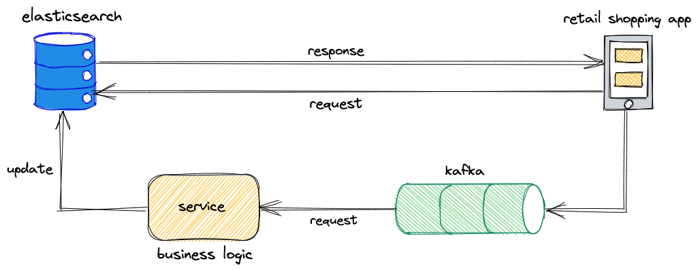
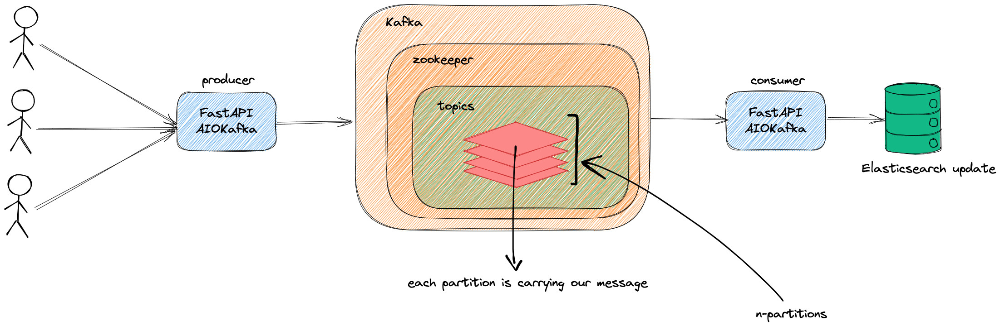

# Retail Updates Streamer

EuroPython 2021 - High Performance Data Processing using Python, Kafka and Elasticsearch.

## Prerequisites

- Python >= 3.6
- FastAPI
- Kafka
- Elasticsearch

## Workflow Architecture

Overall Flow:

<p align="center" width="100%">
     
</p>

Code Explanation:

<p align="center" width="100%">
     
</p>

## Setup

1. Make sure Python >= 3.6 is installed on your local machine and create a virtual environment.

   ```bash
   python3 -m venv retail-updates-streamer
   ```

2. Activate your virtual environment.

   ```bash
   source retail-updates-streamer/bin/activate
   ```

3. Install application packages.

   ```bash
   pip install -r requirements.txt
   ```

4. Add your producer-consumer related config in a `.env` file.

5. For docker setup, add global environment constant in your `zshrc` or `bashrc` depending on shell.

   ```bash
   export DOCKER_KAFKA_HOST = $(ipconfig getifaddr en0)
   ```

6. Please note that I've commented out `elasticsearch` and `kibana` in `docker-compose.yml` as they need a lot of virtual environment memory. You can run these two stacks on local by downloading them as zip from official elastic site.

## Sample CURLs

### Producer

1. Health Check

   Request

   ```bash
   curl --location --request GET 'http://0.0.0.0:8001/ping'
   ```

   Response

   ```json
   {
     "ping": "pong!"
   }
   ```

2. Produce message to Kafka

   Request

   ```bash
   curl --location --request POST 'http://127.0.0.1:8001/producer/retail-product' \
   --header 'Content-Type: application/json' \
   --data-raw '{
      "name": "Funny Farm House Ketchup",
      "category" : "Dips and Ketchups",
      "price" : 15,
      "stock" : 3,
      "product_id": 10,
      "timestamp": ""
   }'
   ```

   Response

   ```json
   {
     "name": "Funny Farm House Ketchup",
     "message_id": "Funny Farm House Ketchup_e5c0f1b0-ac1e-44c7-92c1-1f86728a36dc",
     "topic": "retail-product",
     "timestamp": "2021-07-12 15:17:20.314894"
   }
   ```

### Consumer

1. Health Check

   Request

   ```bash
   curl --location --request GET 'http://0.0.0.0:8000/ping'
   ```

   Response

   ```json
   {
     "ping": "pong!"
   }
   ```

2. Consume messages from Kafka

   Request

   ```bash
   curl --location --request GET 'http://127.0.0.1:8000/consumer/retail-product'
   ```

   Response

   ```json
   {
     "topic": "retail-product",
     "timestamp": "2021-07-12 20:47:21.067802",
     "product_name": "Funny Farm House Ketchup",
     "product_id": 10,
     "success": true
   }
   ```

## Author

👤 Harshit Prasad

Twitter: [@HarshitPrasad8](https://twitter.com/HarshitPrasad8)\
Github: [@harshit98](https://github.com/harshit98)\
Website: [harshitprasad.com](http://harshitprasad.com)\
LinkedIn: [harshit-prasad](https://www.linkedin.com/in/harshit-prasad/)

## 🤝 Contributing

Contributions, issues and feature requests are welcome!

## Show your support

Give a ⭐️ if you think this project is awesome!

## 📝 License

Copyright © 2021 [Harshit Prasad](https://github.com/harshit98)\
This project is [Apache License](https://github.com/harshit98/personalized-search/blob/master/LICENSE) licensed.
